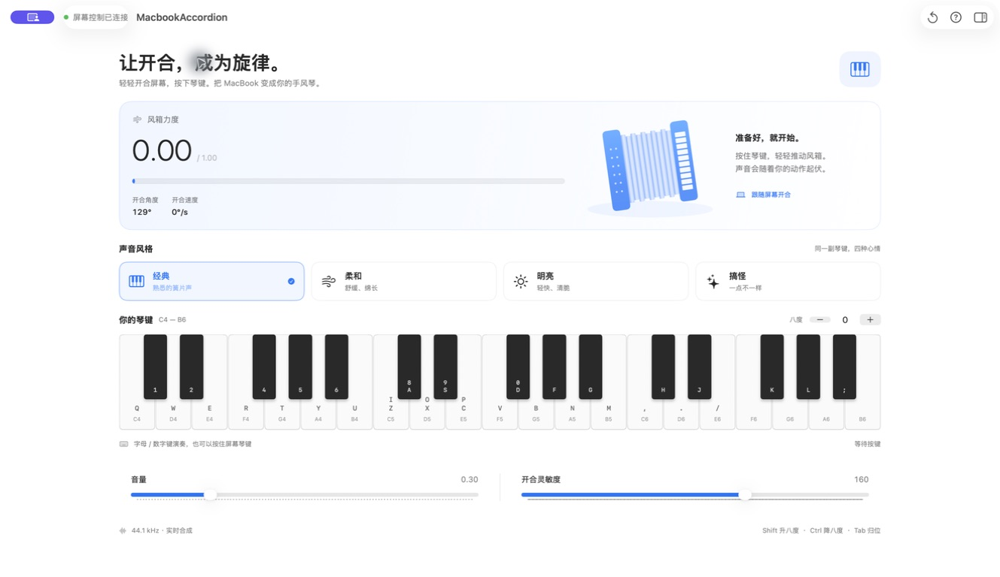

# MacbookAccordion

<p align="center">
  
</p>

<p align="center">
  <strong>开合 MacBook 屏幕控制力度，用电脑键盘随手演奏。</strong><br>
  一个不要求懂手风琴、打开就能玩的 macOS 小应用。
</p>

<p align="center">
  <a href="README.en.md">English</a> ·
  <a href="#开始玩">开始玩</a> ·
  <a href="#项目来源">项目来源</a>
</p>

> [!NOTE]
> 这是基于 [MacacaGames/MacbookAccordion](https://github.com/MacacaGames/MacbookAccordion) 的个人改造版本，用来在本地学习和娱乐。原项目与本仓库均遵循 MIT License。

## 直接下载

> **此分支新增了完整的 Swift 原生版。** 用 Xcode 打开根目录的 `MacbookAccordion.xcodeproj`，选择 `MacbookAccordion` → `My Mac`，按 `⌘R` 运行。原生版需要 macOS 14+，不需要 Python 或第三方运行库。详见 [原生版开发与验证说明](Native/README.md)。下方 1.0.0 下载仍是已发布的 Python 版。

[**下载 MacbookAccordion 1.0.0（DMG）**](https://github.com/simony3/MacbookAccordion/releases/download/v1.0.0/MacbookAccordion-v1.0.0.dmg)

备用下载：[通用 ZIP](https://github.com/simony3/MacbookAccordion/releases/download/v1.0.0/MacbookAccordion-v1.0.0-macOS-universal.zip) · [SHA-256 校验文件](https://github.com/simony3/MacbookAccordion/releases/download/v1.0.0/SHA256SUMS.txt)

1. 打开下载的 DMG。
2. 把 `MacbookAccordion.app` 拖到 `Applications`。
3. 从“应用程序”中启动 MacbookAccordion。

当前版本同时支持 Apple Silicon 和 Intel Mac。由于它没有 Apple Developer ID 签名与公证，macOS 可能阻止首次启动。如果你信任本仓库下载的文件，请先尝试打开一次，然后前往“系统设置 → 隐私与安全性”，在安全性区域选择“仍要打开”。具体操作可参考 [Apple 官方说明](https://support.apple.com/zh-cn/102445)。

## 界面



上图为本分支的原生 SwiftUI 版：演奏反馈、交互琴键、四种音色，以及可收起的声音检查器。原有参数和演奏逻辑保留。上方 1.0.0 下载仍是旧版 Python 应用。

## 可以做什么

- 读取 MacBook 的屏幕开合角度，把开合动作变成声音力度
- 使用电脑键盘演奏两组音域，并在屏幕上显示对应琴键
- 通过 `经典`、`柔和`、`明亮`、`搞怪` 四种声音风格快速切换音色
- 用音量、开合灵敏度和音高按钮完成常用调整
- 无法读取屏幕角度时，自动进入键盘试玩模式，用 `↑` / `↓` 模拟开合
- 需要时打开“声音检查器”（旧版为“更多设置”），继续调整原有的声音与风箱参数

## 开始玩

### 运行原生版（Xcode）

打开 `MacbookAccordion.xcodeproj`，选择 `MacbookAccordion` → `My Mac`，按 `⌘R`。需要 macOS 14+，不需要 Python。

也可在项目目录构建通用版：

```bash
./build_native_app.sh
open 'build/native/Build/Products/Release/MacbookAccordion Native.app'
```

原生构建不会覆盖已安装的旧版应用。参数对照、验证结果及已知限制见 [原生版说明](Native/README.md)。

### 打包旧版 Python macOS App

在项目目录运行：

```bash
chmod +x build_mac_app.sh
./build_mac_app.sh
```

脚本会创建本地虚拟环境、安装依赖、打包应用，并安装到：

```text
/Applications/MacbookAccordion.app
```

启动应用：

```bash
open -a MacbookAccordion
```

> 构建脚本会覆盖 `/Applications/MacbookAccordion.app`，并在安装完成后清理临时的 `build/` 与 `dist/` 目录。

### 直接运行旧版 Python 应用

```bash
python3 -m venv .venv
source .venv/bin/activate
python -m pip install pygame-ce numpy sounddevice pybooklid
python lid_accordion.py
```

## 怎么玩

1. 打开应用，看到“屏幕控制已连接”后，轻轻开合 MacBook 屏幕。
2. 按界面钢琴上的字母或数字键演奏音符。
3. 用 `−` / `+` 调整音高，或选择一种声音风格。
4. 想恢复初始状态时，点击“恢复默认”。

如果显示“键盘试玩模式”，使用 `↑` / `↓` 模拟屏幕开合即可。

### 键盘映射

| 音区 | 白键 | 黑键 |
| --- | --- | --- |
| 中音区 | `Q W E R T Y U I O P` | `1 2 4 5 6 8 9 0` |
| 高音区 | `Z X C V B N M , . /` | `A S D F G H J K L ;` |

`3` 和 `7` 留空，用来保持黑键之间的间距。

### 音高快捷键

| 操作 | 效果 |
| --- | --- |
| 松开 `Shift` | 升高一个八度 |
| 松开 `Ctrl` | 降低一个八度 |
| `Tab` | 恢复默认音高 |

## 声音风格

| 风格 | 听感 |
| --- | --- |
| 经典 | 默认手风琴感觉，适合随手演奏 |
| 柔和 | 起音更缓、余音更长 |
| 明亮 | 反应更快，声音更清脆 |
| 搞怪 | 更明显的失谐与气流感 |

原生版“声音检查器”和旧版“更多设置”均保留进气速度、漏气速度、平滑度、起音、释音、失谐和气流噪声。手动调整声音细节后，应用会把当前状态视为自定义音色。

## 旧版 Python 环境要求

| 项目 | 说明 |
| --- | --- |
| 系统 | macOS |
| 硬件 | 能读取屏幕开合角度的 MacBook；其他环境会进入试玩模式 |
| Python | Python 3 |
| 主要依赖 | `pygame-ce`、`numpy`、`sounddevice`、`pybooklid` |

## 工作原理

原生版通过 IOKit 读取屏幕开合角度，使用 Swift 保留原有风箱模型和合成公式，由 AVAudioEngine 输出音频、SwiftUI 绘制界面。

保留的旧版通过 `pybooklid` 读取角度，`PolyAccordionSynth` 实时合成，`pygame-ce` 绘制 Retina 界面。两套实现的参数、键位和数值结果通过原生测试对照。

## 项目来源

本仓库不是从零开始的原创项目，而是个人拉取并继续改造的版本：

- 原项目：[MacacaGames/MacbookAccordion](https://github.com/MacacaGames/MacbookAccordion)
- 屏幕角度读取思路参考：[samhenrigold/LidAngleSensor](https://github.com/samhenrigold/LidAngleSensor)
- 当前改造：中文 Retina 界面、可视键盘、简单游玩模式、声音预设、应用图标和本地打包流程

感谢原作者公开项目代码。

## License

本项目使用 [MIT License](LICENSE)。保留原许可证和版权声明。
