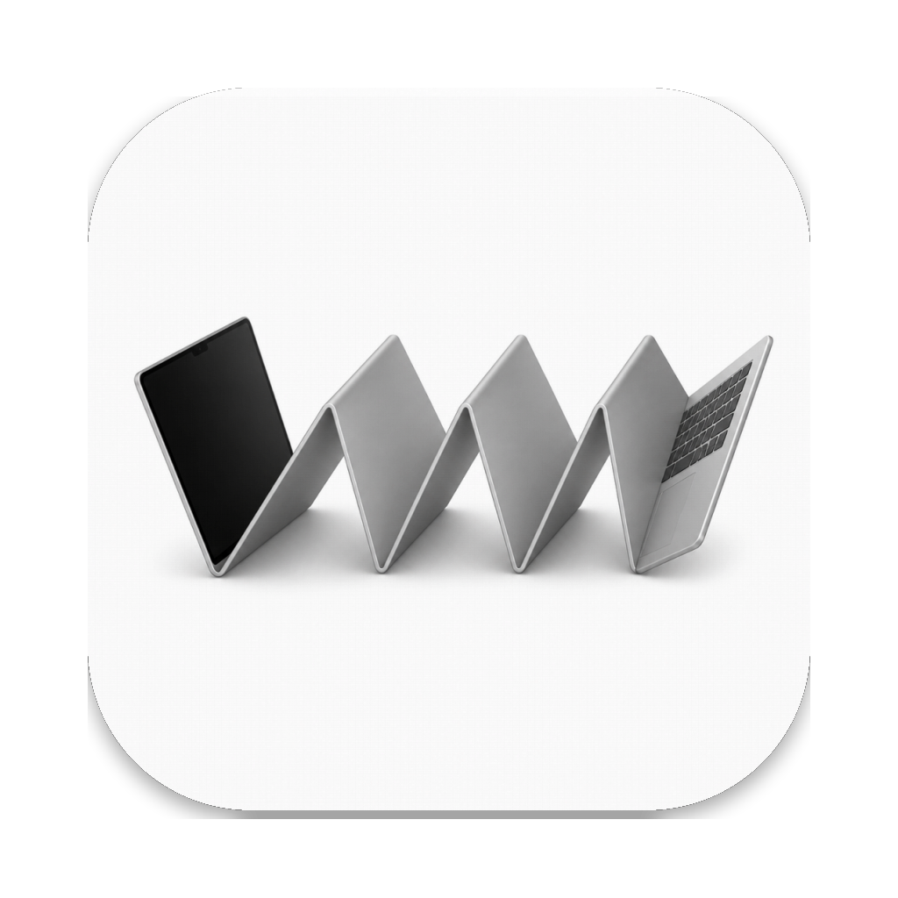
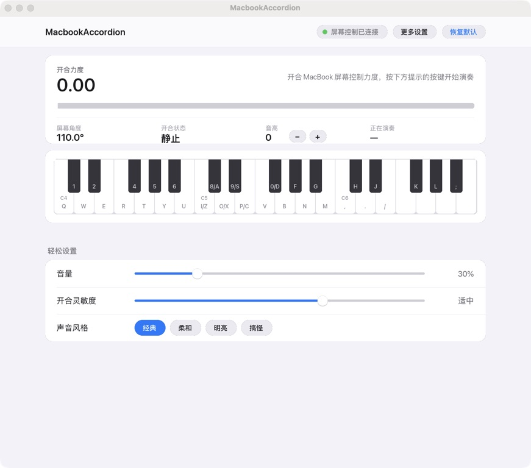

# MacbookAccordion

<p align="center">
  
</p>

<p align="center">
  <strong>开合 MacBook 屏幕控制力度，用电脑键盘随手演奏。</strong><br>
  一个不要求懂手风琴、打开就能玩的 macOS 小应用。
</p>

<p align="center">
  <a href="README.en.md">English</a> ·
  <a href="#开始玩">开始玩</a> ·
  <a href="#项目来源">项目来源</a>
</p>

> [!NOTE]
> 这是基于 [MacacaGames/MacbookAccordion](https://github.com/MacacaGames/MacbookAccordion) 的个人改造版本，用来在本地学习和娱乐。原项目与本仓库均遵循 MIT License。

## 界面



当前界面面向第一次接触手风琴的人：不用理解进气、漏气、失谐等参数，只要开合屏幕并按键即可。

## 可以做什么

- 读取 MacBook 的屏幕开合角度，把开合动作变成声音力度
- 使用电脑键盘演奏两组音域，并在屏幕上显示对应琴键
- 通过 `经典`、`柔和`、`明亮`、`搞怪` 四种声音风格快速切换音色
- 用音量、开合灵敏度和音高按钮完成常用调整
- 无法读取屏幕角度时，自动进入键盘试玩模式，用 `↑` / `↓` 模拟开合
- 需要时展开“更多设置”，继续调整原有的声音与风箱参数

## 开始玩

### 打包成 macOS App

在项目目录运行：

```bash
chmod +x build_mac_app.sh
./build_mac_app.sh
```

脚本会创建本地虚拟环境、安装依赖、打包应用，并安装到：

```text
/Applications/MacbookAccordion.app
```

启动应用：

```bash
open -a MacbookAccordion
```

> 构建脚本会覆盖 `/Applications/MacbookAccordion.app`，并在安装完成后清理临时的 `build/` 与 `dist/` 目录。

### 直接用 Python 运行

```bash
python3 -m venv .venv
source .venv/bin/activate
python -m pip install pygame-ce numpy sounddevice pybooklid
python lid_accordion.py
```

## 怎么玩

1. 打开应用，看到“屏幕控制已连接”后，轻轻开合 MacBook 屏幕。
2. 按界面钢琴上的字母或数字键演奏音符。
3. 用 `−` / `+` 调整音高，或选择一种声音风格。
4. 想恢复初始状态时，点击“恢复默认”。

如果显示“键盘试玩模式”，使用 `↑` / `↓` 模拟屏幕开合即可。

### 键盘映射

| 音区 | 白键 | 黑键 |
| --- | --- | --- |
| 中音区 | `Q W E R T Y U I O P` | `1 2 4 5 6 8 9 0` |
| 高音区 | `Z X C V B N M , . /` | `A S D F G H J K L ;` |

`3` 和 `7` 留空，用来保持黑键之间的间距。

### 音高快捷键

| 操作 | 效果 |
| --- | --- |
| 松开 `Shift` | 升高一个八度 |
| 松开 `Ctrl` | 降低一个八度 |
| `Tab` | 恢复默认音高 |

## 声音风格

| 风格 | 听感 |
| --- | --- |
| 经典 | 默认手风琴感觉，适合随手演奏 |
| 柔和 | 起音更缓、余音更长 |
| 明亮 | 反应更快，声音更清脆 |
| 搞怪 | 更明显的失谐与气流感 |

“更多设置”中仍保留进气速度、漏气速度、平滑度、起音、释音、失谐和气流噪声。手动调整声音细节后，应用会把当前状态视为自定义音色。

## 环境要求

| 项目 | 说明 |
| --- | --- |
| 系统 | macOS |
| 硬件 | 能读取屏幕开合角度的 MacBook；其他环境会进入试玩模式 |
| Python | Python 3 |
| 主要依赖 | `pygame-ce`、`numpy`、`sounddevice`、`pybooklid` |

## 工作原理

应用通过 `pybooklid` 读取屏幕开合角度，计算开合速度，再沿用原项目的风箱模型把速度转换为气量和声音力度。键盘按键对应 MIDI 音符，`PolyAccordionSynth` 使用实时合成产生声音。

界面使用 `pygame-ce` 绘制，并在支持的 Mac 上使用 Retina 高分辨率画布。应用图标同时写入 macOS Bundle 和 Pygame 的运行时窗口，避免被 Pygame 默认图标覆盖。

## 项目来源

本仓库不是从零开始的原创项目，而是个人拉取并继续改造的版本：

- 原项目：[MacacaGames/MacbookAccordion](https://github.com/MacacaGames/MacbookAccordion)
- 屏幕角度读取思路参考：[samhenrigold/LidAngleSensor](https://github.com/samhenrigold/LidAngleSensor)
- 当前改造：中文 Retina 界面、可视键盘、简单游玩模式、声音预设、应用图标和本地打包流程

感谢原作者公开项目代码。

## License

本项目使用 [MIT License](LICENSE)。保留原许可证和版权声明。
